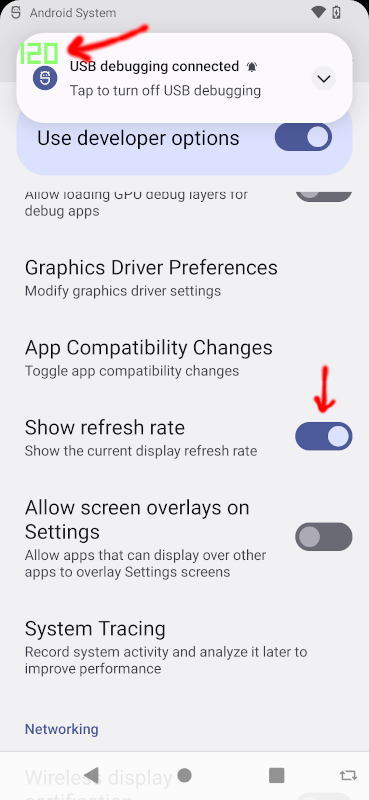

# Unity Render Sample

* This render sample shows how to change the target frame rate. The sample has UI buttons that adjust between 30, 60, 90, 120, and 144 target frame rates.


* Android has a developer setting to display the frame rate cap as an overlay.



* Android can also set the frame rate cap via the `adb CLI`.

```
adb shell settings put system peak_refresh_rate 30.0 && adb shell settings put system min_refresh_rate 30.0

adb shell settings put system peak_refresh_rate 60.0 && adb shell settings put system min_refresh_rate 60.0

adb shell settings put system peak_refresh_rate 90.0 && adb shell settings put system min_refresh_rate 90.0

adb shell settings put system peak_refresh_rate 120.0 && adb shell settings put system min_refresh_rate 120.0

adb shell settings put system peak_refresh_rate 144.0 && adb shell settings put system min_refresh_rate 144.0
```

* This sample project uses the LTS version: `Unity 2020.3.29f1`

* Rendering frame rate can be adjusted using the `Application.targetFrameRate` property.

* Unity documentation on `Application.targetFrameRate` - [Application.targetFrameRate](https://docs.unity3d.com/ScriptReference/Application-targetFrameRate.html)

* Android `Application.targetFrameRate` settings:

```
Application.targetFrameRate = -1; // platform default frame rate
Application.targetFrameRate = 30; // 30 FPS
Application.targetFrameRate = 60; // 60 FPS
Application.targetFrameRate = 90; // 90 FPS
Application.targetFrameRate = 120; // 120 FPS
Application.targetFrameRate = 144; // 144 FPS
```

* Make sure VSync is disabled in `Project Settings->Quality` in order to adjust the target frame rate.


* The [Scene01.unity](Assets\Scenes\Scene01.unity) scene has buttons for adjusting the target frame rate and a particle system to make rendering changes apparent.

* The [ShowTargetFrameRate.cs](Assets/Scripts/ShowTargetFrameRate.cs) script exposes button meta references and connects click events to adjusting the target frame rate.


* The [ShowFPS.cs](Assets/Scripts/ShowFPS.cs) script counts the number of frames rendered every second to display on the fps label.


